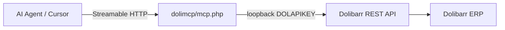

# DoliMCP — Dolibarr MCP extension for AI agents

Expose Dolibarr **projects**, **tasks**, **time reporting**, **employees**, **third parties**, and **invoices** (customer & supplier) to AI agents via **MCP Streamable HTTP**, served **inside your Dolibarr instance** (no separate MCP container).

Each user connects with their own **DOLIMCPKEY** (MCP-only token from the user card); Dolibarr enforces roles on every tool call. The official REST API key is unchanged.

## Documentation

| Guide | Description |
|-------|-------------|
| [doc/updating-dolimcp.md](doc/updating-dolimcp.md) | How to upgrade the module (production, staging, versioning, database migrations) |
| [doc/README.md](doc/README.md) | Documentation index |

## Architecture



| Component | Location |
|-----------|----------|
| MCP Streamable HTTP | `htdocs/custom/dolimcp/mcp.php` |
| Tool implementations | `htdocs/custom/dolimcp/class/` |
| Dolibarr ERP | Official `dolibarr/dolibarr` Docker image or your install |

## Quick start (Docker)

```bash
cp .env.example .env
docker compose up -d
```

1. Open http://localhost:8081 (admin / admin by default).
2. **Home → Setup → Modules** → enable **DoliMCP Bridge**.
3. **Home → Users** → your user → tab **MCP token** → **Generate MCP token** (auto-generated, alphanumeric; cannot be typed manually).
4. Copy the token once, then configure Cursor:

```bash
export DOLIBARR_MCP_TOKEN="paste-token-shown-once"
```

```json
{
  "mcpServers": {
    "dolibarr-streamable-http": {
      "type": "streamableHttp",
      "url": "http://localhost:8081/custom/dolimcp/mcp.php",
      "headers": {
        "DOLIMCPKEY": "${env:DOLIBARR_MCP_TOKEN}"
      }
    }
  }
}
```

Cursor uses **Streamable HTTP** when you configure a `url` (not `command`).

Health check: `GET http://localhost:8081/custom/dolimcp/mcp.php`

## Install on an existing Dolibarr

```bash
cp -r htdocs/custom/dolimcp /var/www/html/custom/dolimcp
```

Enable **REST API**, **Projects**, **Users**, **Third parties**, then enable **DoliMCP Bridge** in modules. For finance tools also enable **Invoices**, **Suppliers**, and **Banks** as needed.

MCP endpoint: `https://your-dolibarr.example.com/custom/dolimcp/mcp.php`

See also [Production install on shared hosting](#production-install-on-shared-hosting) below.

## Production install on shared hosting

Install DoliMCP on production **shared hosting** (cPanel, Plesk, FTP-only, etc.) without Docker. You only need PHP and the ability to upload files into your existing Dolibarr `custom/` directory.

### What you install

The Dolibarr custom module in `htdocs/custom/dolimcp/`. The MCP endpoint is:

`https://your-domain.com/custom/dolimcp/mcp.php`

If Dolibarr is in a subfolder, include it (for example `https://your-domain.com/dolibarr/custom/dolimcp/mcp.php`).

### Prerequisites

| Requirement | Details |
|-------------|---------|
| **Dolibarr** | Version **17.0+** |
| **PHP** | **7.4+** (8.x recommended) |
| **HTTPS** | Strongly recommended in production (MCP token is sent in headers) |
| **Dolibarr modules** | **REST API**, **Projects**, **Users**, **Third parties** (required). **Invoices** / **Suppliers** / **Banks** for finance tools. |
| **Custom modules** | Host must allow a writable `htdocs/custom/` directory |

### 1. Back up production

1. Full **database** backup (phpMyAdmin or host backup tool).
2. Copy **`htdocs/`** and **`documents/`** (or your Dolibarr data directory).

### 2. Upload module files

From this repository, upload the entire folder `htdocs/custom/dolimcp/` to the same path on the server (relative to Dolibarr’s web root).

| Hosting layout | Upload target |
|----------------|---------------|
| Dolibarr at domain root | `public_html/custom/dolimcp/` |
| Dolibarr in a subfolder | `public_html/dolibarr/custom/dolimcp/` |

Use cPanel File Manager, FTP, SFTP, or Git deploy if your host supports it.

After upload, confirm these exist:

- `custom/dolimcp/mcp.php`
- `custom/dolimcp/core/modules/modDolimcp.class.php`
- `custom/dolimcp/sql/`
- `custom/dolimcp/class/`, `lib/`, `admin/`, `langs/`

### 3. File permissions

On typical Linux hosting:

- **Files:** `644`
- **Folders:** `755`
- **`documents/`:** writable by the web server (often `755` or `775`)

On activation, Dolibarr creates under `documents/`:

- `documents/dolimcp/temp`
- `documents/dolimcp/mcp_sessions` (Streamable HTTP sessions)

If activation fails or MCP reports session errors, fix permissions on `documents/`.

### 4. Enable modules in Dolibarr

Log in as **admin**:

1. **Home → Setup → Modules/Applications**
2. Enable **REST API**, **Projects**, **Users**, and **Third parties** (if not already enabled). For invoices, also enable **Invoices** / **Suppliers** / **Banks**.
3. Enable **DoliMCP Bridge** (family *Interface*).

Activation creates the `llx_dolimcp_token` table for MCP tokens.

4. Open **Home → DoliMCP** (or **Setup → Modules → DoliMCP**) to see prerequisites and your MCP URL.

### 5. User rights and MCP tokens

1. **Home → Users → [user]** → tab **MCP token**
2. **Generate MCP token** (shown once—copy and store securely).
3. Create one token per user who will use AI/MCP; Dolibarr permissions apply per user.

Grant normal project rights (`projet/lire`, `projet/creer`, etc.) so tools behave as expected.

### 6. Verify the endpoint

```bash
curl -sS "https://YOUR-DOLIBARR/custom/dolimcp/mcp.php"
```

Expected JSON includes `"status":"ok"` and `"enabled":true`.

- **404** — wrong path (subfolder or `custom` not under web root).
- **503** — **DoliMCP Bridge** not enabled.

### 7. Configure Cursor (or another MCP client)

On your **local machine**, point Cursor at the **production HTTPS** URL (not `localhost`):

```json
{
  "mcpServers": {
    "dolibarr-streamable-http": {
      "type": "streamableHttp",
      "url": "https://YOUR-DOLIBARR/custom/dolimcp/mcp.php",
      "headers": {
        "DOLIMCPKEY": "${env:DOLIBARR_MCP_TOKEN}"
      }
    }
  }
}
```

```bash
export DOLIBARR_MCP_TOKEN="your-generated-mcp-token"
```

Reload MCP in **Cursor Settings → MCP**.

Cursor on your PC calls your **public** Dolibarr URL. The shared host only serves PHP over HTTPS; Node.js and Docker are not required on the server.

### 8. Shared-hosting notes

| Topic | Action |
|--------|--------|
| **Subdirectory install** | Include the subfolder in the MCP `url`. |
| **WAF / mod_security** | Whitelist `mcp.php` if JSON POST requests are blocked. |
| **Cron** | Not required for DoliMCP. |
| **Multi-entity** | You may need the `DOLAPIENTITY` header (same as REST API). |

### 9. Security (production)

1. Use **HTTPS only**; never send `DOLIMCPKEY` over plain HTTP.
2. Treat MCP tokens like passwords; **revoke** from the user card if leaked.
3. Do not commit tokens to Git or publish `mcp.json` with real secrets.
4. Give MCP users the **minimum** Dolibarr permissions they need.
5. Keep Dolibarr and PHP updated on the host.

### 10. Updating the module

See **[doc/updating-dolimcp.md](doc/updating-dolimcp.md)** for the full upgrade guide (when to disable/enable, database migrations, rollback, checklist).

### Shared hosting checklist

- [ ] Dolibarr 17+ with writable `custom/`
- [ ] Uploaded `htdocs/custom/dolimcp/`
- [ ] `documents/` writable
- [ ] Enabled REST API, Projects, Users, Third parties, DoliMCP Bridge (plus Invoices/Suppliers/Banks for finance)
- [ ] Health `GET` on `mcp.php` returns `"status":"ok"`
- [ ] MCP token generated per user
- [ ] Cursor `url` uses production HTTPS + `DOLIMCPKEY`
- [ ] Test a tool (for example `dolibarr_list_projects`)

## MCP tools

**81 tools** covering projects, tasks, time spent, users/employees, third parties/contacts, and customer/supplier invoices (including lines and payments). Add more in `class/mcptoolregistry.class.php` and `class/mcpapibridge.class.php`.

### Highlights

| Area | Key tools |
|------|-----------|
| Projects | `dolibarr_create_project`, `dolibarr_validate_project`, … |
| Third parties | `dolibarr_create_thirdparty`, `dolibarr_list_customers`, `dolibarr_list_suppliers` |
| Contacts | `dolibarr_create_contact` |
| Customer invoices | `dolibarr_create_invoice`, `dolibarr_add_invoice_line`, `dolibarr_validate_invoice`, `dolibarr_add_invoice_payment` |
| Supplier invoices | `dolibarr_create_supplier_invoice`, `dolibarr_add_supplier_invoice_payment` |

## Permissions

- Auth: `DOLIMCPKEY` header (per-user MCP token from **Users → MCP token** tab).
- Official REST `DOLAPIKEY` is separate and not used by DoliMCP.
- Authorization: native REST API checks (`projet/lire`, etc.).
- Use `dolibarr_get_current_user` before destructive operations.

## Repository layout

```
dolibarr/
├── doc/                    # Project documentation
├── docker-compose.yml      # Official Dolibarr + MariaDB only
├── htdocs/custom/dolimcp/  # MCP module (PHP)
│   ├── mcp.php             # Streamable HTTP endpoint
│   └── class/              # Handler, tools, API bridge
└── data/                   # Persistent volumes (gitignored)
```

## GitHub releases

Push a **git tag** to build an installable module ZIP via GitHub Actions (see `.github/workflows/release.yml`):

```bash
git tag v0.4.0
git push origin v0.4.0
```

The workflow uploads `dolimcp-v0.4.0.zip` to a GitHub Release. Unzip into Dolibarr’s `htdocs/custom/` so you get `htdocs/custom/dolimcp/`.

After installing or upgrading a release, follow **[doc/updating-dolimcp.md](doc/updating-dolimcp.md)**.

## Port conflicts

If Docker cannot bind the port, change in `.env`:

```env
DOLI_HTTP_PORT=8082
DOLI_URL_ROOT=http://localhost:8082
```

Update the `url` in `mcp.json` to match.
